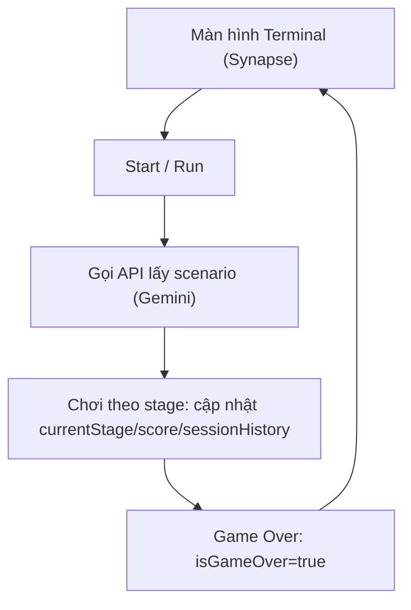

## 1. Product Overview
Synapse là app chơi theo kịch bản (scenario) với giao diện terminal brutalist, điều khiển như bảng lệnh.
App hiển thị “TerminalBoard” kiểu typewriter, theo dõi tiến trình theo stage, tính điểm và lưu lịch sử phiên.

## 2. Core Features

### 2.1 Feature Module
Synapse gồm các trang chính:
1. **Màn hình Terminal (Synapse)**: TerminalBoard typewriter, hiển thị stage hiện tại, nhập lệnh/đáp án, điểm số, trạng thái game, lịch sử phiên, nút bắt đầu lại.

### 2.3 Page Details
| Page Name | Module Name | Feature description |
|---|---|---|
| Màn hình Terminal (Synapse) | Terminal Shell (brutalist UI) | Hiển thị giao diện terminal tối giản, bố cục như console, tập trung vào nội dung chữ và phản hồi theo dòng. |
| Màn hình Terminal (Synapse) | TerminalBoard typewriter | Render output theo hiệu ứng gõ máy chữ; hỗ trợ cuộn; phân biệt dòng hệ thống vs dòng người chơi. |
| Màn hình Terminal (Synapse) | Game State | Quản lý state: `currentStage`, `isGameOver`, `score`, `sessionHistory`; cập nhật theo hành động người chơi và phản hồi từ engine. |
| Màn hình Terminal (Synapse) | Scenario Loader (Gemini) | Gọi API để lấy scenario; hiển thị trạng thái loading/error; nạp dữ liệu scenario vào game state để bắt đầu stage 1. |
| Màn hình Terminal (Synapse) | Session History | Ghi lại các sự kiện/đầu ra theo thời gian vào `sessionHistory`; cho phép xem lại trong cùng phiên. |
| Màn hình Terminal (Synapse) | Run Control | Bắt đầu phiên mới; restart khi game over; reset state về mặc định. |

## 3. Core Process
- Luồng người chơi:
  1) Mở app vào Màn hình Terminal.
  2) Nhấn Start/Run để gọi API lấy scenario.
  3) Scenario được tải, game khởi tạo `currentStage=1`, `score=0`, `isGameOver=false`.
  4) Người chơi nhập lệnh/đáp án, TerminalBoard hiển thị phản hồi (typewriter) và cập nhật `sessionHistory`.
  5) Khi hoàn tất stage, tăng `currentStage` và cộng/trừ `score` theo luật của scenario.
  6) Khi kết thúc game, đặt `isGameOver=true`; cho phép restart để chơi lại.

