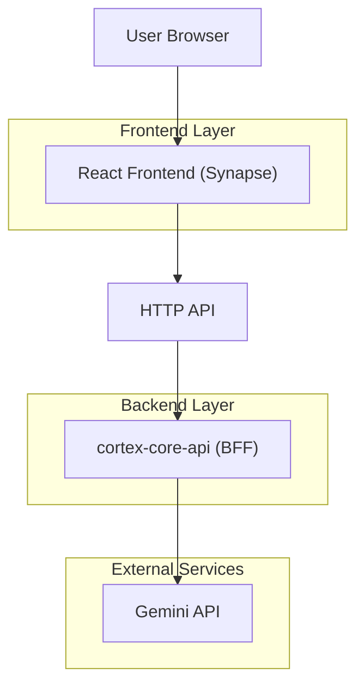
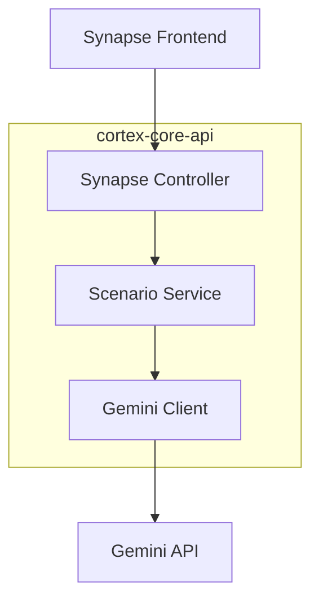

## 1.Architecture design


## 2.Technology Description
- Frontend: React@18 + TypeScript + Vite + brutalist CSS (mono font, high-contrast)
- Backend: Node.js (app `cortex-core-api`) làm BFF để gọi Gemini (giữ API key an toàn)
- Shared Types: `@cortex/types` (tái sử dụng type nền tảng; Synapse bổ sung type scenario ở lớp app nhưng vẫn tuân theo chuẩn TypeScript chung)

## 3.Route definitions
| Route | Purpose |
|---|---|
| / | Màn hình Terminal (Synapse) để tải scenario và chơi theo stage |

## 4.API definitions (If it includes backend services)
### 4.1 Core API
Scenario generation (Gemini)
```
POST /api/synapse/scenario
```
Request (tối thiểu):
| Param Name| Param Type | isRequired | Description |
|---|---:|---:|---|
| sessionId | string | true | ID phiên để correlate log/trace |
| difficulty | string | false | Độ khó (nếu scenario hỗ trợ) |

Response (tối thiểu):
| Param Name| Param Type | Description |
|---|---|---|
| scenarioId | string | ID scenario |
| title | string | Tên kịch bản |
| stages | { id: string; prompt: string }[] | Danh sách stage theo thứ tự |

Shared types (TypeScript, ví dụ cấu trúc dùng chung FE/BE):
```ts
import type { ActionLog } from '@cortex/types';

type SynapseStage = { id: string; prompt: string };

type ScenarioResponse = {
  scenarioId: string;
  title: string;
  stages: SynapseStage[];
};

type SynapseState = {
  currentStage: number;
  isGameOver: boolean;
  score: number;
  sessionHistory: ActionLog[]; // dùng ActionLog để chuẩn hoá lịch sử hành động
};
```

## 5.Server architecture diagram (If it includes backend services)


## 6.Data model(if applicable)
Không yêu cầu database trong phạm vi yêu cầu hiện tại (state chạy trong app: `currentStage/isGameOver/score/sessionHistory`).
